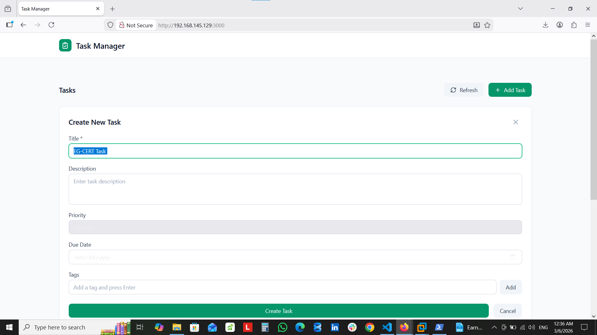
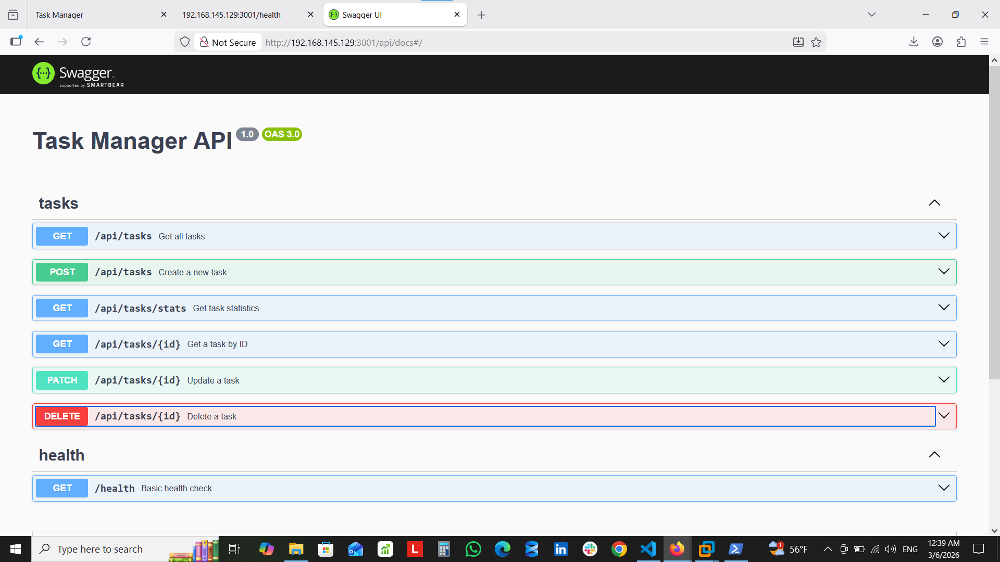
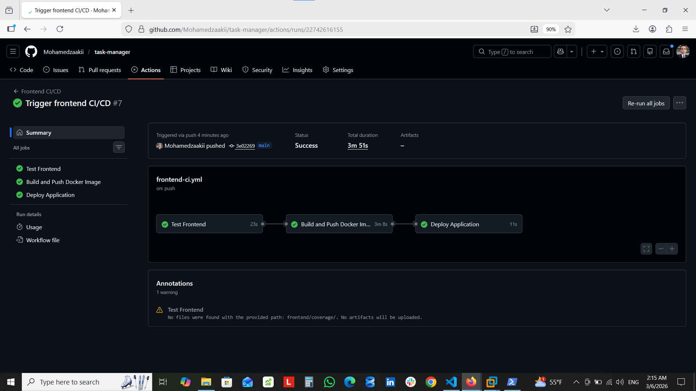

# Task Manager - Full Stack Application
<p align="center">
  
  
  
  
  
  
  
</p>



## ✨ Features
- ✅ Create, read, update, and delete tasks
- ✅ Responsive UI
- ✅ RESTful API with Swagger documentation
- ✅ Full Docker containerization
- ✅ Automated CI/CD with GitHub Actions

## 🛠️ Tech Stack
### Backend
- **Framework**: NestJS
- **Language**: TypeScript
- **API Documentation**: Swagger
- **Testing**: Jest

### Frontend
- **Framework**: Next.js 14
- **Language**: TypeScript
- **Testing**: Jest
  
### DevOps
- **Containerization**: Docker
- **Orchestration**: Docker Compose
- **CI/CD**: GitHub Actions
- **Registry**: Docker Hub

## 📋 Prerequisites
#### ensure the installation of:
- [Node.js](https://nodejs.org/) (v20 or higher)
- [Docker](https://www.docker.com/products/docker-desktop/)
- [Docker Compose](https://docs.docker.com/compose/install/)
- [Git](https://git-scm.com/)
- [Docker Hub](https://hub.docker.com/) account


## 📁 Project Structure
```text
task-manager/
├── backend/ 
│ ├── src/ 
│ │ ├── health/ 
│ │ └── tasks/ 
│ ├── test/ 
│ ├── Dockerfile 
│ ├── .dockerignore 
│ └── package.json 
├── frontend/ 
│ ├── src/ 
│ │ ├── app/
│ │ ├── components/ 
│ │ └── lib/ 
│ ├── Dockerfile 
│ ├── .dockerignore
│ └── package.json 
├── .github/
│ └── workflows/
│ ├── backend-ci.yml 
│ └── frontend-ci.yml 
├── docker-compose.yml 
├── .gitignore
├── images/ 
└── README.md 
```
## 🚀 Local Development
### 1. Clone the repository
```bash
git clone https://github.com/Mohamedzaakii/task-manager.git
cd task-manager
```
### 2. Backend Setup
```bash
cd backend
npm install
npm run start:dev
```
- API Docs: http://localhost:3001/api/docs


### 3. Frontend Setup
```bash
cd frontend
npm install
npm run dev
```
- Frontend runs at: http://localhost:3000
  
## 🐳 Docker Setup
- ### Building Images
```bash
# Build backend image
cd backend
docker build -t yourusername/task-manager-backend:latest .

# Build frontend image
cd frontend
docker build -t yourusername/task-manager-frontend:latest \
  --build-arg NEXT_PUBLIC_API_URL=http://localhost:3001 .  

```
- ### Docker Compose
```bash
# Start all services
docker compose up -d

# View logs
docker compose logs -f

# Stop all services
docker compose down

```
## 🔄 CI/CD Pipeline (GitHub Actions)
- ### Backend Pipeline 
  
- ### Frontend Pipeline 
 

### Backend Pipeline (.github/workflows/backend-ci.yml)
- Trigger: Push to main/develop with changes in backend/**
- Jobs:
  - Test: Runs linter, unit tests, and e2e tests
  - Build & Push: Builds Docker image and pushes to Docker Hub
  - Deploy: Pulls latest images and deploys with Docker Compose
### Frontend Pipeline (.github/workflows/frontend-ci.yml)
- Trigger: Push to main/develop with changes in frontend/**
- Jobs:
  - Test: Runs linter and unit tests
  - Build & Push: Builds Docker image and pushes to Docker Hub
  - Deploy: Pulls latest images and deploys with Docker Compose

    
## 🔑 GitHub Actions Secrets
- DOCKER_USERNAME: Docker Hub username	
- DOCKER_PASSWORD:	Docker Hub access token (Read & Write)

## GitHub Actions Variables
NEXT_PUBLIC_API_URL: http://localhost:3001

## 🚢 Deployment
- ### Automated Deployment
The CI/CD pipeline automatically deploys when changes are pushed to the main branch
- Tests run
- Images are built and pushed to Docker Hub
- Latest images are pulled and containers restart

## 🐛 Troubleshooting
- ### Port Already in Use
```bash
sudo lsof -i :3000
sudo lsof -i :3001
```
- ### Container Not Starting
```bash
docker compose logs backend
docker compose logs frontend
```

## 📝 License

This project is licensed under the MIT License.


